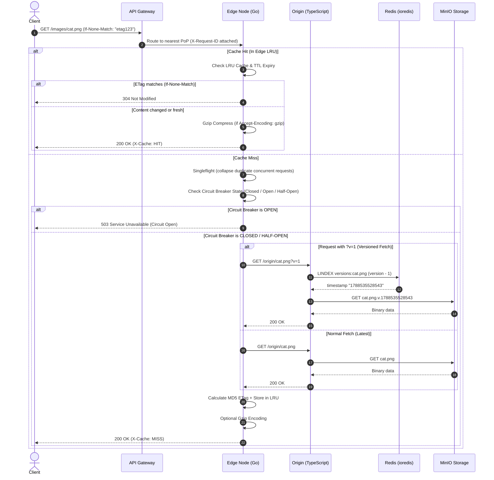
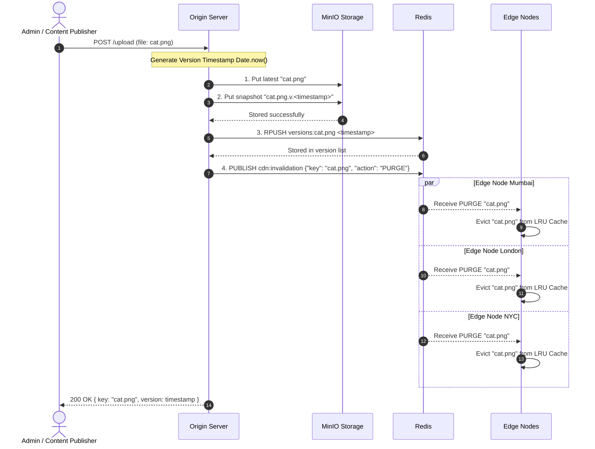
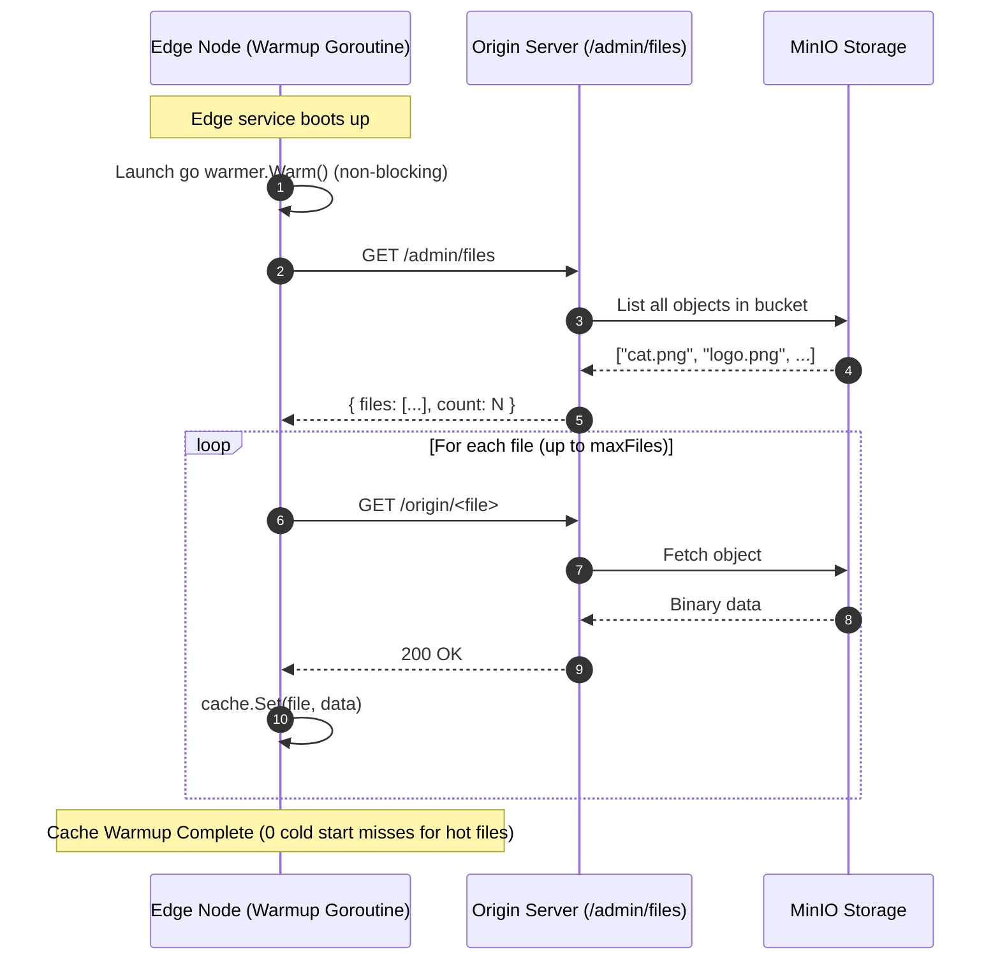

# Mini CDN

A distributed Content Delivery Network built from scratch — no CDN libraries, no shortcuts.


---

## What It Does

3 edge nodes (Mumbai, London, NYC) sit behind a TypeScript API Gateway that routes requests by region, runs health checks every 5 seconds, and automatically fails over if a node goes down. Each edge node caches files in RAM using a hand-rolled LRU cache. When files are updated, Redis Pub/Sub invalidates stale cache across all edges in under 5ms.

---

## Architecture

```
                        [ USER ]
                           |
                           | HTTP request
                           v
              +---------------------------+
              |       API GATEWAY         |
              |  - GeoIP routing          |
              |  - Health checks          |
              |  - Rate limiting          |
              |  - Auto failover          |
              +---------------------------+
                /           |           \
               /            |            \
              v             v             v
   +----------+      +----------+      +----------+
   |  EDGE    |      |  EDGE    |      |  EDGE    |
   |  Mumbai  |      |  London  |      |  NYC     |
   |  :8081   |      |  :8082   |      |  :8083   |
   +----------+      +----------+      +----------+
   | LRU Cache|      | LRU Cache|      | LRU Cache|
   | RAM only |      | RAM only |      | RAM only |
   +----+-----+      +----+-----+      +----+-----+
        |                 |                 |
        +-----------------+-----------------+
                          |  cache miss
                          v
             +-------------------+
             |   ORIGIN SERVER   |
             |  - file uploads   |
             |  - serve files    |
             +--------+----------+
                      |
                      v
             +-------------------+
             |   MinIO / S3      |
             |  object storage   |
             +-------------------+

     INVALIDATION
     +-----------------+
     |  Redis Pub/Sub  |  <-- origin publishes PURGE on upload
     +-----------------+
        |         |
     Edge A    Edge B
     (deletes   (deletes
     stale)     stale)
```

---





``` mermaid 
    
    graph TB
    subgraph Clients["Clients / Users"]
        C1["Client (India)"]
        C2["Client (UK / Europe)"]
        C3["Client (US / Americas)"]
    end

    subgraph GatewayLayer["API Gateway (TypeScript / Express)"]
        GW["API Gateway :8080<br/>• GeoIP Routing<br/>• Request Tracing (X-Request-ID)"]
    end

    subgraph EdgeLayer["Edge PoP Layer (Go)"]
        subgraph EdgeMumbai["Edge Mumbai :8081"]
            EM_LRU["LRU Cache + TTL"]
            EM_ETag["ETag & 304 Validation"]
            EM_CB["Circuit Breaker"]
            EM_SF["Singleflight (Dedup)"]
            EM_GZIP["Gzip Compression"]
            EM_Warm["Cache Warmer"]
        end

        subgraph EdgeLondon["Edge London :8082"]
            EL_LRU["LRU Cache + TTL"]
            EL_CB["Circuit Breaker"]
            EL_Warm["Cache Warmer"]
        end

        subgraph EdgeNYC["Edge NYC :8083"]
            EN_LRU["LRU Cache + TTL"]
            EN_CB["Circuit Breaker"]
            EN_Warm["Cache Warmer"]
        end
    end

    subgraph OriginLayer["Origin Server (TypeScript / Node.js) :3000"]
        API_Fetch["GET /origin/:file(?v=n)"]
        API_Upload["POST /upload"]
        API_Admin["GET /admin/files<br/>GET /admin/versions/:file"]
        VerModule["Versioning Module"]
        PurgePub["Purge Publisher"]
    end

    subgraph StorageLayer["Data & Messaging Infrastructure"]
        MinIO[("MinIO (S3 Object Storage) :9000<br/>• latest: file.ext<br/>• versioned: file.ext.v.timestamp")]
        Redis[("Redis :6379<br/>• Pub/Sub: cdn:invalidation<br/>• Lists: versions:key")]
        Prometheus["Prometheus Metrics :9090"]
    end

    %% Client to Gateway
    C1 -->|HTTP Req| GW
    C2 -->|HTTP Req| GW
    C3 -->|HTTP Req| GW

    %% Gateway to Edge
    GW -->|Geo: IN| EdgeMumbai
    GW -->|Geo: GB| EdgeLondon
    GW -->|Geo: US| EdgeNYC

    %% Edge to Origin & Redis
    EM_CB -->|Cache Miss| API_Fetch
    EL_CB -->|Cache Miss| API_Fetch
    EN_CB -->|Cache Miss| API_Fetch

    Redis -.->|PURGE Event Pub/Sub| EM_LRU
    Redis -.->|PURGE Event Pub/Sub| EL_LRU
    Redis -.->|PURGE Event Pub/Sub| EN_LRU

    EM_Warm -->|Startup GET /admin/files| API_Admin

    %% Origin internals
    API_Upload --> VerModule
    VerModule -->|1. Store latest & snapshot| MinIO
    VerModule -->|2. RPUSH timestamp| Redis
    API_Upload --> PurgePub
    PurgePub -->|3. PUBLISH PURGE| Redis

    API_Fetch -->|Read version metadata| Redis
    API_Fetch -->|Fetch object data| MinIO

    %% Metrics
    EdgeMumbai -.->|Scrape /metrics| Prometheus

```

## Request Lifecycle

## File Upload




## cache warming Lifecycle




## Tech Stack

| Layer | Tech | Why |
|-------|------|-----|
| API Gateway | TypeScript (Express) | GeoIP routing, health checks, failover |
| Edge Nodes | Go | Goroutines, fast HTTP, low memory |
| LRU Cache | Go (hand-rolled) | O(1) get/set/evict, no external lib |
| Origin Server | TypeScript (Express) | File uploads, MinIO integration |
| Object Storage | MinIO | S3-compatible, runs in Docker |
| Cache Invalidation | Redis Pub/Sub | Fast, reliable, simple |
| Metrics | Prometheus | Industry standard |
| Dashboard | React + Recharts | Live graphs |
| Containers | Docker Compose | One command startup |

---

## Features

- **Hand-rolled LRU Cache** — HashMap + Doubly Linked List, every operation O(1)
- **3 Edge Nodes** — Mumbai, London, NYC with shared-nothing architecture
- **Singleflight** — 1000 concurrent cache misses = exactly 1 origin request
- **Cache Invalidation** — Redis Pub/Sub PURGE events, ~5ms propagation to all edges
- **Health Checks** — Gateway polls every 5s, auto-failover to next nearest edge
- **Fault Tolerance** — Edge dies? Rerouted. Redis dies? Cache still works. Origin dies? Cached files still served.
- **Prometheus Metrics** — hit rate, p95/p99 latency, evictions, memory per edge
- **Rate Limiting** — 100 requests/minute per IP at gateway level

---

## Project Structure

```
mini-cdn/
├── gateway/                  # TypeScript — routing, health checks, proxy
│   └── src/
│       ├── index.ts
│       ├── router.ts         # GeoIP logic, edge selection
│       ├── healthcheck.ts    # polls /health every 5s
│       ├── ratelimiter.ts
│       ├── proxy.ts          # forwards request to edge
│       └── config.ts
│
├── origin/                   # TypeScript — uploads, MinIO, Redis publish
│   └── src/
│       ├── index.ts
│       ├── routes/
│       │   ├── upload.ts     # POST /upload
│       │   ├── fetch.ts      # GET /origin/:file
│       │   └── delete.ts     # DELETE /file/:id
│       ├── storage/
│       │   └── minio.ts      # MinIO client
│       └── invalidation/
│           └── publisher.ts  # Redis PURGE publish
│
├── edge/                     # Go — LRU cache, singleflight, Redis subscribe
│   ├── main.go
│   ├── server.go             # HTTP handlers
│   ├── cache/
│   │   ├── lru.go            # LRU core (HashMap + DLL)
│   │   ├── node.go           # Node struct
│   │   └── lru_test.go
│   ├── origin/
│   │   └── fetcher.go        # singleflight fetch
│   ├── invalidation/
│   │   └── subscriber.go     # Redis PURGE listener
│   └── metrics/
│       └── prometheus.go     # counters, gauges, histograms
│
├── dashboard/                # React — live metrics dashboard
├── config/
│   ├── prometheus.yml        # scrape config
│   └── regions.yml           # region → edge mapping
├── scripts/                  # test scripts
└── docker-compose.yml
```

---

## Getting Started

### Prerequisites

- Docker + Docker Compose
- Go 1.21+
- Node.js 20+

### Run Everything

```bash
git clone https://github.com/yourusername/mini-cdn
cd mini-cdn
docker compose up --build
```

### Services

| Service | URL |
|---------|-----|
| Gateway | http://localhost:8080 |
| Edge Mumbai | http://localhost:8081 |
| Edge London | http://localhost:8082 |
| Edge NYC | http://localhost:8083 |
| Origin | http://localhost:3000 |
| MinIO Console | http://localhost:9001 |
| Prometheus | http://localhost:9090 |
| Dashboard | http://localhost:5173 |

---

## Usage

### Upload a file
```bash
curl -X POST http://localhost:3000/upload \
  -F "file=@cat.png"

# response
{ "success": true, "key": "cat.png" }
```

### Fetch a file (via gateway)
```bash
# Indian user → Mumbai edge
curl -H "X-Region: IN" http://localhost:8080/file/cat.png

# London user → London edge
curl -H "X-Region: GB" http://localhost:8080/file/cat.png

# NYC user → NYC edge
curl -H "X-Region: US" http://localhost:8080/file/cat.png
```

### Watch cache hit/miss
```bash
# first request — cache miss
curl -v http://localhost:8080/file/cat.png
# X-Cache: MISS

# second request — cache hit
curl -v http://localhost:8080/file/cat.png
# X-Cache: HIT

# upload new version
curl -X POST http://localhost:3000/upload -F "file=@new_cat.png"
# PURGE published → all edges invalidated

# next request — cache miss again (fresh version)
curl -v http://localhost:8080/file/cat.png
# X-Cache: MISS
```

### View metrics
```bash
curl http://localhost:8081/metrics

# output
cdn_cache_hits_total 42
cdn_cache_misses_total 5
cdn_cache_hit_rate 0.894
cdn_cache_size_bytes 486539264
cdn_evictions_total 3
```

### Run integration tests

Start the stack, then run the end-to-end suite:

```bash
docker compose up --build -d
./scripts/integration_test.sh
```

The suite verifies cache MISS → HIT behavior, Redis invalidation after an overwrite on every edge, gateway failover when Mumbai is stopped, and that 50 concurrent misses result in one origin request.

---

## How Cache Invalidation Works

```
Admin uploads new cat.png
        ↓
Origin stores in MinIO
        ↓
Origin publishes to Redis:
{ "type": "PURGE", "key": "cat.png" }
        ↓
Redis broadcasts to all edges
        ↓
Mumbai → cache.Delete("cat.png")
London → cache.Delete("cat.png")
NYC    → cache.Delete("cat.png")
        ↓
Next request → cache MISS → fetches fresh version
```

---

## Fault Tolerance

| Failure | What Happens |
|---------|-------------|
| Edge dies | Gateway detects via health check, reroutes to next nearest edge |
| Redis dies | Cache still works, invalidation paused, TTL acts as safety net |
| Origin dies | Cached files still served to millions of users |
| All edges die | Gateway returns 502 gracefully |

---

## LRU Cache Implementation

```
HashMap + Doubly Linked List

HEAD ←→ [most recent] ←→ ... ←→ [least recent] ←→ TAIL

GET:  HashMap lookup → move node to HEAD         O(1)
SET:  Insert at HEAD → evict TAIL if over cap    O(1)
DEL:  HashMap lookup → unlink node               O(1)
```

---

## Running Tests

```bash
# LRU cache unit tests
cd edge
go test ./cache/... -v

# load test
./scripts/load_test.sh

# invalidation test
./scripts/test_invalidation.sh
```

---

## What This Demonstrates

- LRU Cache from scratch (not just "used Redis")
- Concurrency in Go (goroutines, mutexes, singleflight)
- Distributed systems thinking (fault tolerance, eventual consistency)
- Event-driven architecture (pub/sub invalidation)
- Observability (Prometheus metrics, live dashboard)
- Infrastructure design (stateless compute, stateful storage)
- Networking (HTTP proxying, WebSocket, streaming)

---

## License

MIT
